<!-- ╔═══════════════════════════════════════════════════════════════╗ -->
<!-- ║                    ZAUFANY  ·  Zaufanys                       ║ -->
<!-- ╚═══════════════════════════════════════════════════════════════╝ -->

  

 

<b>&nbsp; S &nbsp; T &nbsp; A &nbsp; C &nbsp; K &nbsp;</b>

  

 

 

  

 

<b>&nbsp; C &nbsp; O &nbsp; N &nbsp; N &nbsp; E &nbsp; C &nbsp; T &nbsp;</b>

  

  
 

<picture>
  <source media="(prefers-color-scheme: dark)" srcset="https://raw.githubusercontent.com/Zaufanys/Zaufanys/output/github-snake-dark.svg" />
  <source media="(prefers-color-scheme: light)" srcset="https://raw.githubusercontent.com/Zaufanys/Zaufanys/output/github-snake.svg" />
  
</picture>

  

<i>trust is earned, never granted.</i>

